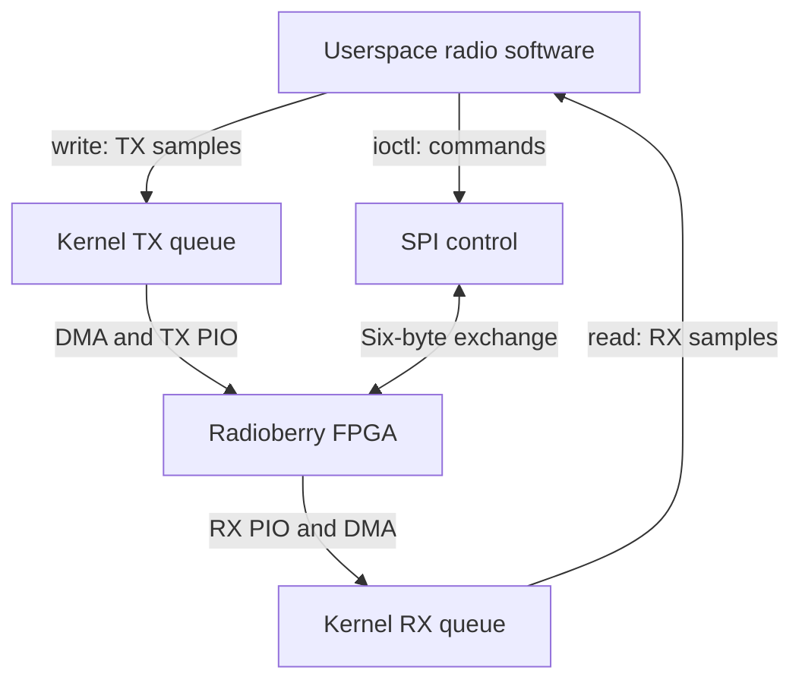

# Radioberry Pi 5 driver: implementation guide

Documentation baseline: upstream commit `f8e8e3b4ddfaccda92e3309e1c22168a88e3f32f`, module version **5.54**. Prepared 10 September 2026. The documented implementation is `SBC/rpi-5/device_driver/pio-mode/driver`, not the archived Pi 5 driver or the Pi 3/4 variants.

This guide explains what the source does, including its limitations. It is a source review, not a hardware validation report. Added C comments preserve executable tokens and PIO instruction words. No defect fixes are included. [REVIEW.md](REVIEW.md) separates directly observed defects from questions requiring the external RP1 driver or hardware.

## Contents

1. [Architecture and responsibilities](#architecture-and-responsibilities)
2. [Source map](#source-map)
3. [GPIO interface](#gpio-interface)
4. [Initialisation and lifetime](#initialisation-and-lifetime)
5. [Application interface](#application-interface)
6. [Transmit path](#transmit-path)
7. [Receive path](#receive-path)
8. [PIO configuration](#pio-configuration)
9. [DMA, memory and concurrency](#dma-memory-and-concurrency)
10. [Control protocol](#control-protocol)
11. [FPGA configuration](#fpga-configuration)
12. [Build and integration](#build-and-integration)
13. [Function reference](#function-reference)
14. [Validation and troubleshooting](#validation-and-troubleshooting)
15. [Sources](#sources)

## Architecture and responsibilities

The module provides a byte-stream character device and a control ioctl for a Radioberry radio attached to a Raspberry Pi 5. The external `rp1_pio_*` kernel API provides access to RP1 programmable I/O state machines, instruction memory and DMA transfers. The Radioberry module supplies the PIO programs and coordinates software buffering.

There are three different interfaces to the board:

| Interface | Work performed | Implementation |
|---|---|---|
| FPGA configuration | Upload a binary gateware image at startup | CPU-driven GPIO using RIO registers |
| Radio control | Send commands and receive status | Linux SPI subsystem |
| RX/TX sample streaming | Transport digitised I/Q components | RP1 PIO state machines and DMA |

PIO is a small instruction engine for pin-level operations. It can execute pin reads, pin writes, jumps and FIFO operations with explicit cycle delays. DMA moves blocks between memory and the PIO FIFOs. The CPU still copies buffers, checks receive metadata, services system calls and submits subsequent transfers. Hardware offload therefore does not mean zero CPU work or zero-copy operation.



The userspace program in `device_driver/firmware/radioberry.c` bridges radio packets and `/dev/radioberry`. Its directory name, `firmware`, should not be confused with the `.rbf` FPGA image. The kernel sample transport does not implement audio demodulation, FFTs or RF tuning arithmetic. Radio command meanings and FPGA signal processing belong to the adjacent application/gateware layers.

## Source map

All paths in this table are relative to the driver directory.

| Source | Main responsibility |
|---|---|
| `rb2-rp1-pio.c` | Module entry/exit; SPI/platform registration; character device; read/write/ioctl |
| `src/rb2-rx-stream.c` | RX setup, 18-word PIO program, DMA callback and metadata validation |
| `src/rb2-tx-stream.c` | TX setup, nine-word PIO program, queueing and DMA continuation |
| `src/rb2-trx-control.c` | Pin preparation and synchronous SPI exchange |
| `src/rb2-load-fpga.c` | Firmware request and FPGA configuration bit-banging |
| `src/rb2-rpi5.c` | RP1 register mapping and GPIO helpers |
| `include/rb2-rp1-pio.h` | Shared stream/context structures and buffer sizes |
| `include/radioberry_ioctl.h` | Userspace command structure and ioctl number |
| Other headers | Function declarations, pin assignments, external PIO includes |
| `radioberry.dts` | Device-tree overlay for SPI, PIO and the platform device |
| `Makefile` | Kernel module and device-tree build |

The six C translation units form one `radioberry.ko` module. The external RP1 driver is a separate dependency.

## GPIO interface

Numbers below are GPIO identifiers, not physical 40-pin header positions. Directions are from the Pi's perspective. Confirm the matching board/gateware before changing wiring.

| Group | Signal | GPIO | Direction | Purpose |
|---|---|---:|---|---|
| RX | D0 | 18 | Input | Least significant bit of each four-bit nibble |
| RX | D1 | 19 | Input | Nibble bit 1 |
| RX | D2 | 20 | Input | Nibble bit 2 |
| RX | D3 | 21 | Input | Nibble bit 3 |
| RX | READY | 25 | Input | Select whether PIO enters the sample-read sequence |
| RX | CLK | 6 | Output | Side-set clock |
| TX | DATA | 5 | Output | Serial I/Q word |
| TX | CLK | 4 | Output | Side-set clock |
| TX | READY | 12 | Input | Select whether PIO begins another word; pull-down configured |
| SPI | MOSI | 10 | Output | Command data |
| SPI | MISO | 9 | Input | Returned status |
| SPI | SCLK | 11 | Output | SPI clock |
| SPI | CE0 | 8 | Output | Control peripheral chip select |
| SPI | CE1 | 7 | Output function selected | Helper configures this pin, though control device uses CS0 |
| Configuration | DATA | 13 | Output | FPGA image bits |
| Configuration | DCLK | 24 | Output | FPGA image clock |
| Configuration | NCONFIG | 27 | Output | Configuration reset/control |
| Configuration | NSTATUS | 26 | Input | Configuration status |
| Configuration | CONF_DONE | 22 | Input | FPGA reports configuration completion |

PIO pin mux selection is function 7. Direct RIO selection is function 5. The SPI helper selects function 0. These constants are specific to the hardware mapping used here.

## Initialisation and lifetime

`radioberry_init()` performs these operations in order:

1. Register the SPI driver. Its probe stores `spi_ctrl_dev` and calls `spi_setup()`.
2. Register the platform driver. Its probe resolves the `pio` device-tree phandle and retrieves RP1 driver data.
3. Allocate a character-device major number and create the class/device named `radioberry`.
4. Initialise the exclusive-open mutex.
5. Map the RP1 peripheral register window.
6. Request and upload `radioberry.rbf`.
7. Configure SPI and initial RX/TX GPIO functions/directions.
8. Allocate the shared context; configure and start RX; configure TX.
9. Mark the context ready after both configurations succeed.

The platform probe and sample setup are separate. The probe stores platform driver data, but the stream code opens its RP1 clients through `rp1_pio_open()` rather than using that stored pointer directly.

RX is enabled and its first DMA work is scheduled during module loading. TX is enabled during loading but needs FIFO data before a DMA block is submitted. The character device exists before the shared context is ready; opening during that interval returns `-ENODEV`.

`open()` resets both software FIFOs and sets `file->private_data` to the global context. It does not re-create streams, reset FPGA FIFOs or cancel DMA. `release()` clears that pointer and unlocks the mutex. It does not stop streaming or flush TX. The log saying streaming is enabled on open should be read in this context.

Unload unregisters interfaces, unmaps RP1 registers and cleans up PIO contexts. Cleanup cancels restart work, disables each SM, removes its program, unclaims it and closes its client. Correct final DMA quiescence depends on the external RP1 implementation. Current failure paths do not provide a complete reverse-order resource unwind; see REVIEW.md.

## Application interface

### Exclusive open

`open("/dev/radioberry", O_RDWR)` obtains the single global context. A second open returns `-EBUSY`. This limits open instances, but does not prevent several threads sharing the same descriptor from making concurrent calls. There is no per-read/write/ioctl mutex.

### Read contract and output

For receiver count `n`, the handler computes:

- `groups = floor(504 / (6*n + 2))`
- `pairs = groups*n`
- requested internal FIFO bytes = `pairs*8`
- nominal returned userspace bytes = `pairs*6`

The `+2` represents the space reserved in the surrounding protocol group beyond its receiver I/Q samples. The adjacent userspace packet builder arranges those protocol frames; the driver returns only the receiver sample bytes.

| Receivers | Groups | Total I/Q pairs | Internal bytes | Nominal returned bytes |
|---:|---:|---:|---:|---:|
| 1 | 63 | 63 | 504 | 378 |
| 2 | 36 | 72 | 576 | 432 |
| 3 | 25 | 75 | 600 | 450 |
| 4 | 19 | 76 | 608 | 456 |
| 5 | 15 | 75 | 600 | 450 |
| 6 | 13 | 78 | 624 | 468 |
| 7 | 11 | 77 | 616 | 462 |
| 8 | 10 | 80 | 640 | 480 |

These are code-derived sizes for the encoded range, not a claim that every gateware image implements eight receivers. The callback tags components from zero through `2*n-1`.

The read waits up to one second for the nominal number of internal bytes, then aligns to metadata zero, removes bytes from the FIFO, strips metadata and copies to userspace. Alignment or concurrent activity can reduce the actual count. There is no full-group validation after draining.

Each returned component is three bytes in high-to-low significance order. Two components occupy six bytes. The driver does not sign-extend or scale them. A consumer interpreting a signed 24-bit number must perform that conversion itself.

**Existing ABI defect:** `read()` ignores the caller's maximum byte count and replaces it with the calculated size. The bundled userspace packet builder even passes a sample count rather than a byte count. Fixing only one side can break their existing coupling. A conventional generic file reader is therefore not a safe drop-in consumer of this implementation.

Timeout returns `-EAGAIN`, zero copied bytes returns `-EIO`, and a failed user copy returns `-EFAULT`. A negative interrupted-wait result is not propagated. The file operations do not implement `poll`, `mmap`, or a distinct nonblocking path based on `O_NONBLOCK`.

### Write contract and output

TX expects a continuous byte stream whose four-byte units are `[I_hi, I_lo, Q_hi, Q_lo]`. The supplied userspace `txWriter()` discards the first four bytes of each eight-byte packet group and writes its trailing I/Q bytes when MOX or CWX is active. The driver preserves raw bit patterns rather than applying a numeric conversion.

`write()` allocates `len` bytes, copies from userspace, waits up to one second for that much FIFO space and enqueues. A successful return reports bytes accepted into the software queue. It does not acknowledge FPGA receipt or RF transmission. Partial writes must not silently discard the unaccepted suffix.

Lengths greater than the 32768-byte FIFO cannot satisfy its space predicate. Four-byte alignment is not enforced, so independently generated malformed writes can change word boundaries. A final partial DMA block remains pending. There is no drain ioctl or tail-flush operation.

### Ioctl ABI

`RADIOBERRY_IOC_COMMAND` is defined as `_IOW('x', 1, __u8)`, but the actual handler copies a whole `struct rb_info_arg_t` in both directions. Keep the existing number when interoperating with this source. Changing it to `_IOWR` with a structure size is an ABI change that must be coordinated.

The structure contains nine `int` members: `major`, `minor`, `fpga`, `nr`, `nt`, `version`, `rb_command`, `command`, and `command_data`. It is 36 bytes on the usual Pi Linux ABI with four-byte `int`. The header uses ordinary `int`, not explicitly sized fields, and no `compat_ioctl` is supplied. See the control section for field packing and REVIEW.md for uninitialised output fields.

## Transmit path

### Software and DMA sequence

`radioberry_write()` copies application data; `rb2_tx_stream_write()` puts it in the TX `kfifo`; `tx_dma_restart_work()` invokes `tx_dma_kick_now()` once a full block is available.

`tx_dma_kick_now()` first checks for 16384 bytes and claims the running flag. It removes a block into `irq_scratch`, obtains the selected external DMA buffer, and constructs 4096 words. For example, four bytes `12 34 AB CD` produce the numerical word `0x1234ABCD`. A DMA write barrier orders the memory writes before submission. `rp1_pio_sm_xfer_data(..., PIO_DIR_TO_SM, ...)` starts the transfer with `tx_iq_data_dma_callback` as completion handler.

The callback alternates buffer index 0/1, clears `dma_running` and submits another full block directly if available. Otherwise it schedules work, which leaves the stream idle if it still lacks a full block. Alternating buffers do not by themselves establish concurrent ping-pong DMA: this source explicitly submits the next block following completion of the preceding transfer.

### What the PIO program does

The following table describes all nine encoded instructions. Addresses are relative to the loaded program. `side` sets the clock pin as part of instruction execution; `[2]` adds two delay cycles to the instruction's ordinary cycle.

| PC | Encoded word | Operation | Meaning |
|---:|---|---|---|
| 0 | `0x1ac2` | `jmp pin, 2 side 1 [2]` | Raise clock and check ready. High enters the word path. |
| 1 | `0x1200` | `jmp 0 side 0 [2]` | Lower clock and poll again if ready was low. |
| 2 | `0xb242` | `nop side 0 [2]` | Lower clock before preparing the word. |
| 3 | `0xe03f` | `set x, 31` | Set the loop counter for 32 bits. |
| 4 | `0x80a0` | `pull block` | Load output shift register from PIO FIFO; stall if empty. |
| 5 | `0x6001` | `out pins, 1` | Output next bit on GPIO 5, MSB first. |
| 6 | `0xba42` | `nop side 1 [2]` | Raise GPIO 4 and hold for the instruction/delay cycles. |
| 7 | `0x1245` | `jmp x--, 5 side 0 [2]` | Lower clock and loop while pre-decrement X is nonzero. |
| 8 | `0x0000` | `jmp 0` | Return to ready polling. |

`X=31` and the conditional decrement cause 32 visits to PC 5. With left-shifting output, the sequence is I bit 15 through I bit 0, then Q bit 15 through Q bit 0.

**The clock also pulses in the ready-poll loop.** Ready is tested before a word, not before every data bit. If the PIO TX FIFO is empty at `pull block`, execution stalls after PC 2 has lowered the clock. There is no additional chip-select or I/Q-select GPIO in this PIO interface.

### Timing, throughput and latency

From the instruction sequence, each transmitted data bit takes 7 SM cycles: one for OUT, three for the high-clock NOP and three for the low-clock jump. A ready-immediately, non-stalling word takes `3+3+1+1+32*7+1 = 233` SM cycles. Each failed ready poll adds 6 cycles. These are instruction-derived counts, not measured pin timing.

If the actual PIO source frequency is `f`, the TX divider gives `f_SM=f/8`; ideal word throughput is `f/(8*233)` pairs/s before stalls. The driver alone does not establish a measured source frequency or sustained radio sample rate. Do not confuse serial bit-clock rate with I/Q sample rate.

At an illustrative 48,000 pairs/s, 4096 pairs represent 85.33 ms of samples. That is the data duration of one software DMA block, not an end-to-end latency measurement. Initial block accumulation depends on how quickly the application supplies samples, and queued/FPGA buffering adds further delay. A final short transmission can remain queued because the code requires a full block.

## Receive path

### PIO capture

PIO receives four parallel data bits from GPIO 18..21. It collects seven nibbles per component, meaning 28 useful bits. The programmed input shifter shifts left and automatically pushes after 28 bits. The callback interprets bits 27:24 as metadata and bits 23:0 as the sample component. The remaining upper nibble of the 32-bit DMA word is ignored.

| PC | Encoded word(s) | Operation | Meaning |
|---:|---|---|---|
| 0 | `0x000f` | `jmp 15` | Enter ready polling on startup or wrap. |
| 1,3,5,7,9,11,13 | `0xbb42` | `nop side 1 [3]` | Raise clock for each nibble. |
| 2,4,6,8,10,12,14 | `0x5004` | `in pins, 4 side 0` | Lower clock and shift in one nibble. |
| 15 | `0xba42` | `nop side 1 [2]` | High phase of the ready/handshake clock. |
| 16 | `0xb242` | `nop side 0 [2]` | Low phase. |
| 17 | `0x00c1` | `jmp pin, 1` | Read another component if GPIO 25 is high. Otherwise wrap to PC 0. |

Seven nibble pairs consume 35 SM cycles. The successful ready-check sequence at PCs 15..17 adds 7, giving 42 cycles per component in the continuously ready, non-stalling case. A failed poll includes PC 0 and takes 8 cycles. RX uses divider 2. These counts exclude FIFO backpressure, external bus timing and any input synchronisation effects.

Pin sampling and side-set appear in the same PIO instruction. The exact FPGA sampling/launch edge and setup/hold margins must be checked against matching gateware and measured hardware; this source establishes the Pi-side sequence only.

### DMA callback and metadata

RX configures two 24576-byte DMA buffers. A complete block contains 6144 32-bit component words. The callback walks those words:

1. Extract metadata as `(word >> 24) & 0x0f`.
2. If not synchronised, discard until metadata zero.
3. Compare with `meta_expected`. On mismatch, clear synchronisation and discard that word.
4. For an accepted component, append metadata followed by the three sample bytes to scratch storage.
5. Increment expected metadata, wrapping after `2*nrx`.
6. Insert accepted bytes into the software FIFO, reset the old FIFO first if it lacks space, then wake readers.
7. Flip active buffer, clear the running flag and schedule the next receive transfer.

For two receivers the expected tag cycle is `0,1,2,3`; these are the successive I/Q component positions. The driver verifies order but does not independently demultiplex receivers. Userspace uses the order to build protocol groups. Metadata zero identifies the start of a group.

A zero tag encountered while already synchronised but expecting another value is itself discarded as a mismatch. Resynchronisation waits for a later zero. This can drop more than the minimum number of words.

The current callback publishes accepted components incrementally rather than staging and validating an entire receiver group. Metadata loss can therefore leave partial group material in the software FIFO; aligning the next read to zero does not validate every group inside that read.

### Buffer representation

For a numerical DMA word `0x0M123456`, the software FIFO receives four bytes `0M 12 34 56`. The read handler removes `0M` and returns `12 34 56`. This byte extraction is explicit and does not simply expose host-endian DMA memory to the application.

After alignment, the read compacts four-byte records into three-byte components in a local 1024-byte stack buffer. Because each destination is behind its source, this particular forward in-place compaction preserves unread bytes. The valid encoded receiver counts produce no more than 640 internal bytes, but caller count handling remains defective independently of that internal bound.

## PIO configuration

The driver uses raw configuration words rather than named field-building helpers. The following interpretation follows the PIO field layout implied by the encoded programs and register assignments. Confirm it against the exact external PIO headers/implementation before changing values.

| Setting | RX | TX | Interpretation |
|---|---|---|---|
| `clkdiv` | `0x00020000` | `0x00080000` | Integer dividers 2 and 8 |
| initial `execctrl` | `0x5901f600` | `0x4c01fb80` | Jump inputs GPIO 25/12; optional side-set enabled |
| `shiftctrl` | `0x01c10000` | `0x00000000` | RX left shift, autopush at 28 bits; TX left shift, explicit PULL |
| `pinctrl` | `0x40091800` | `0x40101005` | RX input base 18, side-set base 6; TX output base 5/count 1, side-set base 4 |
| program length | 18 | 9 | Total 27 encoded instructions |
| relative wrap | 0..17 | 0..8 | Bounds relocated after loading |

Both pin configurations reserve two side-set bits in the instruction encoding: one enable bit for optional side-set and one actual clock value bit. Instructions without side-set retain the previous clock output rather than necessarily driving it low.

The programs request `RP1_PIO_ORIGIN_ANY`. Returned `prog_offset` is used as initial PC, and wrap top/bottom fields are recalculated relative to it. The actual instruction arrays still contain relative-looking JMP targets. Correct relocation of those targets is a contract to verify in the external `rp1_pio_add_program()` implementation. This repository's wrapper alone is not evidence that every external driver version relocates them correctly.

## DMA, memory and concurrency

`radioberry_client_ctx` holds RX and TX `radioberry_stream` objects. Each stream contains:

| Field(s) | Meaning |
|---|---|
| `client`, `sm` | External RP1 client and claimed state-machine number |
| `prog_offset`, `prog_length` | Allocated instruction region |
| `dma_size`, `active_buffer` | Block size and selected external buffer index |
| `dma_done[2]` | Initialised/signalled completion objects; unused for transfer waits |
| `dma_restart` | Deferred restart work |
| `dma_running` | Atomic flag used to guard submissions |
| `dma_fifo` | Embedded 32768-byte software byte FIFO |
| `queue` | Reader/writer wait queue |
| `fifo_lock` | Spinlock used around FIFO modifications |
| `nrx`, `meta_expected`, `meta_synced` | RX receiver count and ordering state |
| `irq_scratch` | Embedded 24576-byte conversion buffer, also used by TX |

The embedded byte arrays total 114688 bytes across both streams, before structure overhead. Configured external DMA buffers total 81920 bytes: two RX blocks plus two TX blocks. This is a configured-size accounting, not measured allocation footprint; the external driver can allocate additional bookkeeping or aligned storage. TX also allocates a temporary buffer per application write, and reads use a 1024-byte stack buffer.

Process-context work is distinct from the DMA callback context. RX callback processing includes a full block scan and FIFO copy. TX may pack and submit the next block directly from its callback. Whether the external API can safely be called there depends on its execution-context and locking guarantees.

The spinlocks protect individual FIFO modifications, not every compound operation or all fields. `nrx` changes through ioctl while callbacks use it. Open resets queues without stopping transfers. Metadata peek/discard uses separate lock acquisitions. There is no stopping flag to prevent a completion from scheduling new work during shutdown. The external driver must be included in any full concurrency audit.

`dma_running` suppresses some duplicate submissions, but it is not a reference count or a proof of callback completion. Work cancellation is similarly not equivalent to terminating DMA. Buffer coherence and cache maintenance are delegated to RP1; `dma_wmb()` orders TX writes but does not by itself prove the mapping's cache-coherence contract.

## Control protocol

`radioberry_ioctl()` serialises an input structure into this SPI payload:

| Byte | Value |
|---:|---|
| 0 | Low 8 bits of `rb_command` |
| 1 | Low 8 bits of `command` |
| 2 | `command_data[31:24]` |
| 3 | `command_data[23:16]` |
| 4 | `command_data[15:8]` |
| 5 | `command_data[7:0]` |

`rb2_trx_control(data, data, 6)` sends and receives through the same six-byte buffer using one synchronous SPI message. If `(byte1 & 0xfe)==0`, the requested receiver count is `((byte5 & 0x38)>>3)+1`. The handler stores it in the RX stream after the transaction, even if the SPI exchange fails because that return value is currently ignored.

Returned bytes are decoded as follows:

| Structure member | Returned value |
|---|---|
| `rb_command` | Byte 0 |
| `fpga` | Byte 3 bits 1:0 |
| `nr` | Byte 3 bits 5:2 |
| `nt` | Byte 3 bits 7:6 |
| `major` | Byte 4 |
| `minor` | Byte 5 |
| `version` | Constant 554 |
| `command`, `command_data` | Not initialised in the return structure |

The final two members are an information-disclosure concern because the whole stack structure is copied to userspace. The source documents capability counts `nr` and `nt`, but does not enforce the requested receiver count against them.

## FPGA configuration

`loading_radioberry_gateware()` uses `request_firmware()` with the filename `radioberry.rbf`. The Linux firmware search configuration determines its location. The driver does not choose a board variant dynamically, so the supplied image must match the intended FPGA.

`firmware_load()` allocates an image copy, sets GPIO directions and calls preparation. Preparation drives NCONFIG, DATA and DCLK low, sleeps one second, raises NCONFIG and polls NSTATUS with bounded one-second waits. It returns failure after its counter reaches two.

For each image byte, `upload_gateware_byte()` emits bits 0 through 7 on GPIO 13, delays one microsecond per bit and pulses GPIO 24. This LSB-first configuration transfer differs from MSB-first TX sample serialisation. No PIO or DMA is used for the image upload.

Activation checks NSTATUS and CONF_DONE and, if both are asserted, adds two final clocks. Its return value is zero on both success and failure. The caller ignores preparation status as well. Missing image or failed configuration can therefore leave module setup continuing without a functioning radio. The current logs are more informative than the loader's return contract.

## Build and integration

The Makefile builds against `/lib/modules/$(uname -r)/build` by default and includes local headers. It sets `KBUILD_EXTRA_SYMBOLS` to `/home/pi/git/rp1-driver/Module.symvers`. The stream headers require `<linux/pio_rp1.h>` and declare the external buffer accessor. The matching external module must export the functions with compatible signatures and semantics.

An illustrative build, after preparing matching dependencies on a Pi build system, is:

```sh
cd SBC/rpi-5/device_driver/pio-mode/driver
make KERNEL_HEADERS=/lib/modules/$(uname -r)/build \
  KBUILD_EXTRA_SYMBOLS=/absolute/path/to/rp1-driver/Module.symvers
```

This was not run as a kernel build in the documentation environment. The target also invokes `dtc` to produce `radioberry.dtbo`. Kernel versions can change APIs such as class creation and external PIO signatures, so successful compilation cannot be promised solely from this repository.

The device-tree overlay:

- Targets BCM2712.
- Disables the existing `spidev0` and `spidev1` nodes.
- Enables `rp1_pio` and SPI0.
- Creates a CS0 SPI peripheral matching `radioberry_ctrl_spi`, requesting maximum 48 MHz.
- Adds the `sdr,radioberry` platform node with a PIO phandle.

It contains numeric `spi-mode` and `spi-bits-per-word` properties. Their presence is not proof that the running SPI core interprets them. Verify the effective SPI mode and word width with the target binding/core, because standard mode selection commonly uses boolean CPOL/CPHA properties. This is recorded as an integration question rather than silently claiming an effective mode.

The local install target copies `radioberry_ioctl.h` from the driver root even though this source stores it under `include/`; it also loads the module with `insmod` and sets device permissions to 0666. It does not constitute a complete boot-time overlay/gateware/dependency installation. Do not treat it as a validated installer.

The adjacent systemd service starts `/etc/init.d/radioberryd` as root using `Type=forking`, after network-online, with restart enabled. It concerns the userspace service. Inspect the chosen installation scripts and dependency setup separately from the kernel transport.

## Function reference

The annotated sources add a purpose/lifetime comment before every one of the 41 C function definitions. This index supports targeted reading.

### Module and device interface: `rb2-rp1-pio.c`

| Function | Inputs and result | Important side effect |
|---|---|---|
| `rb2_rp1_pio_init` | Device pointer; 0/error | Allocate global context; configure both streams |
| `rb2_rp1_pio_deinit` | No args/result | Clean streams and free shared context |
| `spi_ctrl_probe` | SPI device; setup status | Set global SPI pointer |
| `radioberry_align_fifo_on_meta0` | RX stream | Remove leading nonzero-tag records |
| `radioberry_read` | File, user buffer, count; bytes/error | Consume RX records and strip metadata |
| `radioberry_write` | File, user buffer, length; bytes/error | Allocate/copy/enqueue TX bytes |
| `radioberry_open` | Inode/file; 0/error | Lock exclusive access and reset queues |
| `radioberry_release` | Inode/file; 0 | Clear private data and unlock |
| `radioberry_ioctl` | File, command, user pointer; 0/error | SPI exchange, RX count update, returned status |
| `radioberry_probe` | Platform device; 0/error | Resolve and store RP1 driver data |
| `radioberry_init` | Module entry; 0/error | Register devices and configure radio resources |
| `radioberry_exit` | Module exit | Unregister and release resources |

### RX: `src/rb2-rx-stream.c`

| Function | Role |
|---|---|
| `radioberry_init_ctx` | Initialise RX embedded objects and default metadata state |
| `configure_rx_iq_sm` | Claim/configure/load/enable RX PIO and DMA |
| `dma_restart_work` | Submit RX DMA from deferred work |
| `rx_iq_data_dma_callback` | Validate/repack a block, enqueue, wake and restart |
| `radioberry_cleanup_rx_ctx` | Release RX PIO/client resources |

### TX: `src/rb2-tx-stream.c`

| Function | Role |
|---|---|
| `radioberry_init_tx_ctx` | Initialise TX queue and transfer state |
| `configure_tx_iq_sm` | Claim/configure/load/enable TX PIO and DMA |
| `rb2_tx_stream_write` | Insert application bytes and schedule if ready |
| `tx_dma_kick_now` | Pack and submit one complete TX block |
| `tx_dma_restart_work` | Deferred entry to the submission helper |
| `tx_iq_data_dma_callback` | Alternate buffers and continue if possible |
| `radioberry_cleanup_tx_ctx` | Release TX PIO/client resources |

### Control and configuration

| Function | File | Role |
|---|---|---|
| `rb2_trx_initialize` | `rb2-trx-control.c` | Set SPI and initial sample GPIO functions |
| `rb2_trx_control` | `rb2-trx-control.c` | Synchronous full-duplex SPI message |
| `upload_gateware_byte` | `rb2-load-fpga.c` | Shift one configuration byte LSB first |
| `prepare_gateware_loading` | `rb2-load-fpga.c` | Reset interface and poll status |
| `initialize_gateware` | `rb2-load-fpga.c` | Set configuration GPIO directions |
| `activate_gateware` | `rb2-load-fpga.c` | Check status and issue final clocks |
| `firmware_load` | `rb2-load-fpga.c` | Copy and upload binary image |
| `loading_radioberry_gateware` | `rb2-load-fpga.c` | Acquire/release firmware through Linux |

### GPIO helpers: `src/rb2-rpi5.c`

| Function | Role |
|---|---|
| `initialize_rpi` | Map 64 MiB at `0x1f00000000`; derive GPIO/RIO/PAD views |
| `deinitialize_rpi` | Unmap peripheral window |
| `initialize_gpio_for_output` | Select RIO, set pad and enable output |
| `initialize_gpio_for_input` | Select RIO, set pad and disable output |
| `set_pin` | Enable output and write RIO SET alias |
| `clr_pin` | Enable output and write RIO CLR alias |
| `read_pin` | Extract one bit of RIO input |
| `read_pin_all` | Read full input bitmap |
| `setPinMode` | Write only GPIO function selector |

GPIO/RIO/PAD byte offsets are `0xd0000`, `0xe0000`, and `0xf0000`. Pointer arithmetic divides these by four. SET/CLR register aliases are at RIO offsets `0x2000`/`0x3000`. Direct volatile structure accesses and the hard-coded mapping are existing implementation choices; portable kernel MMIO/resource management deserves separate review.

## Validation and troubleshooting

Documentation validation checks that comments leave C tokens unchanged, PIO arrays unchanged, all 41 function definitions annotated, and the patch cleanly applicable to its baseline. These checks establish documentation-only edits, not working hardware or a correct original driver.

A future functional validation should use a matching Pi 5, board image and external RP1 driver. Useful focused checks include:

| Symptom/question | First source/hardware check |
|---|---|
| Module cannot resolve PIO symbols | Matching kernel headers, exported symbols and Module.symvers |
| Cannot open device | gctx readiness, exclusive-open state, permissions and init logs |
| RX timeout | GPIO 25, RX clock/data, DMA submission/completion and FIFO occupancy |
| RX discontinuities | Metadata errors, callback FIFO resets and consumer timing |
| No TX for short burst | 16384-byte minimum DMA block and unflushed tail |
| TX write stalls | Missing space wakeup and FPGA ready state |
| Wrong TX bits | Byte order, PIO shift direction, pin mux and JMP relocation |
| Loading reports success but board unresponsive | Actual FPGA status, image match and ignored loader errors |
| Unload/reload crash | Callback quiescence and failed-init ownership paths |

For a logic-analyser experiment, capture DATA/CLK/READY together and send a known four-byte pattern repeated for at least one full block. Distinguish the handshake clock pulses from the 32 data-bit pulses, and verify FPGA-side reception rather than assuming a DMA callback means the final RF sample has been emitted. Any transmit hardware experiment needs an appropriate radio test setup; no such test was performed here.

## Sources

All implementation claims are anchored to the pinned upstream source. Links below stay valid even if master changes:

- [Driver entry and ABI](https://github.com/pa3gsb/Radioberry-2.x/blob/f8e8e3b4ddfaccda92e3309e1c22168a88e3f32f/SBC/rpi-5/device_driver/pio-mode/driver/rb2-rp1-pio.c)
- [TX implementation and encoded PIO](https://github.com/pa3gsb/Radioberry-2.x/blob/f8e8e3b4ddfaccda92e3309e1c22168a88e3f32f/SBC/rpi-5/device_driver/pio-mode/driver/src/rb2-tx-stream.c)
- [RX implementation and encoded PIO](https://github.com/pa3gsb/Radioberry-2.x/blob/f8e8e3b4ddfaccda92e3309e1c22168a88e3f32f/SBC/rpi-5/device_driver/pio-mode/driver/src/rb2-rx-stream.c)
- [Remaining driver sources, headers and build files](https://github.com/pa3gsb/Radioberry-2.x/tree/f8e8e3b4ddfaccda92e3309e1c22168a88e3f32f/SBC/rpi-5/device_driver/pio-mode/driver)
- [Userspace packet and I/Q handling](https://github.com/pa3gsb/Radioberry-2.x/blob/f8e8e3b4ddfaccda92e3309e1c22168a88e3f32f/SBC/rpi-5/device_driver/firmware/radioberry.c)

PIO timing and configuration interpretations are explicitly source-derived; external-driver internals, exact FPGA receive logic, RF scaling and measured electrical timing remain outside the validated scope of this package. Original upstream licensing notices are retained unchanged; this documentation does not attempt to resolve any inconsistencies between file notices and module metadata.
