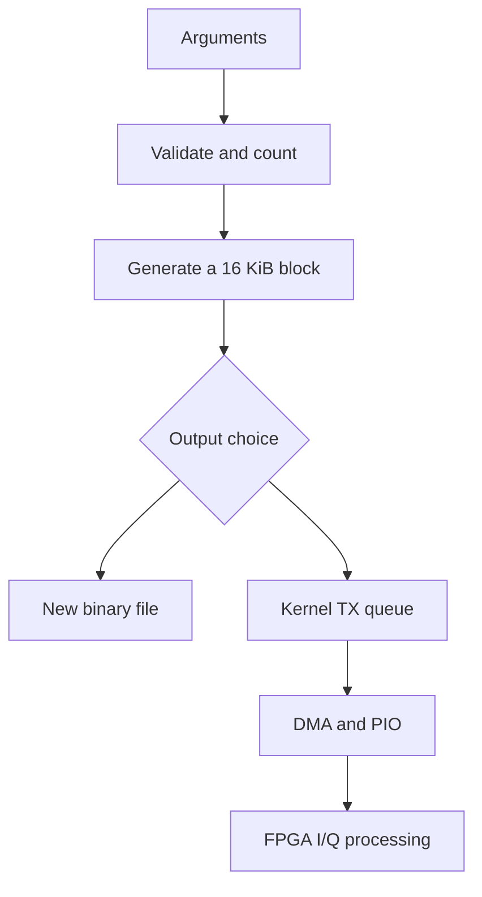

# Learn the transmitter by following the data

This guide accompanies the heavily commented [tx.cpp](tx.cpp). It explains
both the radio representation and the C++/Linux mechanisms used to transport
it. Read [README.md](README.md) for build commands and hardware prerequisites.
The code is a userspace program using the existing kernel driver. It does not
implement a new kernel module, and it does not prove RF transmission completes.

## 1. Start with five different units

Much of the apparent complexity comes from using the word “sample” for several
things. In this code the units are:

| Unit | Concrete example | What it means |
|---|---|---|
| Input character | `'1'` | One character in the command-line string |
| Message bit | Logical 1 | Information you want to encode |
| BPSK symbol | Positive I for 48 sample instants | Waveform representing one bit |
| I/Q pair or transport word | I = 4096, Q = 0 | Two 16-bit values at one sample instant |
| DMA block | 4096 words = 16384 bytes | Minimum block the present TX driver submits |

`./radioberry-tx 1010 ...` passes four characters, not the binary integer ten.
The program maps those characters to values itself.

In BPSK mode, one bit produces `samples_per_bit` I/Q pairs. In raw mode, 32
characters produce one transport word and no modulation is performed.

## 2. What I and Q represent

Think of I and Q as the real and imaginary coordinates of a complex baseband
sample, `z[n] = I[n] + j Q[n]`. One common idealised upconversion convention is

`RF(t) = I(t) cos(2*pi*f_c*t) - Q(t) sin(2*pi*f_c*t)`.

The exact hardware sign convention, filtering and scaling depend on gateware.
The equation explains the concept, not a verified description of every stage
of this FPGA. For this program's Q=0 waveform, changing I from +A to -A reverses
carrier sign, equivalent to a 180-degree phase change. That is why two I-axis
values can represent BPSK.

The chosen mapping is:

| Input bit | I | Q | Packed bytes at A=4096 |
|---|---:|---:|---|
| 0 | -4096 | 0 | `F0 00 00 00` |
| 1 | +4096 | 0 | `10 00 00 00` |
| Tail/padding | 0 | 0 | `00 00 00 00` |

A logical zero is therefore not silence. Zero-valued I/Q padding is silence at
the input to the radio processing chain, though filter transients can persist
beyond the transition to zero input.

Rectangular symbols have abrupt transitions. The prototype deliberately omits
pulse shaping, framing, preambles, coding and carrier/symbol recovery. Those
are later modem features, not jobs performed by a byte-stream device driver.

## 3. A complete small example

Generate four bits with three sample instants per bit:

```sh
./radioberry-tx 1010 --samples-per-bit 3 --amplitude 4096 --output lesson.iq
```

`parse()` produces an Options value. `layout()` then derives these counts:

| Calculation | Result |
|---|---:|
| Bits in one message | 4 |
| Sample instants per bit | 3 |
| Repetitions | 1 |
| Payload words | 4 * 3 * 1 = 12 |
| Explicit zero tail | 0 |
| Total before padding | 12 |
| Padded words | 4096 |
| Automatic zero words | 4084 |
| Output file bytes | 4096 * 4 = 16384 |

The first 12 words are:

| Global word indices | Selected bit index | Input bit | I |
|---|---:|---:|---:|
| 0, 1, 2 | 0 | 1 | +4096 |
| 3, 4, 5 | 1 | 0 | -4096 |
| 6, 7, 8 | 2 | 1 | +4096 |
| 9, 10, 11 | 3 | 0 | -4096 |
| 12 through 4095 | Outside payload | None | 0 |

Inspect the result without a radio:

```sh
python3 - <<'PY'
from pathlib import Path
import struct
b = Path('lesson.iq').read_bytes()
print('File bytes:', len(b))
print('First 48 bytes:', b[:48].hex(' '))
print('First 12 I/Q pairs:', list(struct.iter_unpack('>hh', b[:48])))
print('All padding is zero:', not any(b[48:]))
PY
```

`>hh` means big-endian, signed 16-bit, signed 16-bit. It interprets the exact
same four-byte contract expected by the kernel. The utility refuses to replace
an existing `lesson.iq`, so use a new name for a subsequent experiment.

## 4. Read the source in a productive order

The top-to-bottom definition order lets C++ functions call helpers already
declared. That is not necessarily the best learning order.

| Reading step | Source element | Main question |
|---:|---|---|
| 1 | `Options`, `Layout` | What state do we represent, and in what units? |
| 2 | `word_at()` | What numerical word belongs at position n? |
| 3 | `fill_block()` | How do words become bytes? |
| 4 | `main()` | How are generation and output connected? |
| 5 | `Sink::write_block()` | What if an OS write accepts only part of a block? |
| 6 | `Sink` construction/destruction | Who owns the file descriptor? |
| 7 | `parse()`, `number()`, `control()` | How do we reject bad input before I/O? |
| 8 | `send_control()` | How do userspace values cross a device-specific ABI? |
| 9 | Signals, error paths and hold loop | What do failure and “finished” actually mean? |

Each function in tx.cpp has a purpose comment. Additional comments appear at
non-obvious operations rather than only at function boundaries.

## 5. The important C++ vocabulary in this file

| Construct | Meaning here | Why it matters |
|---|---|---|
| `std::uint8_t` | Exactly 8 unsigned bits | Represents output bytes |
| `std::int16_t` | Signed 16-bit value | Represents one I or Q value |
| `std::uint32_t` | Exactly 32 unsigned bits | Bitwise transport word |
| `std::uint64_t` | Large unsigned counter | Sample counts can exceed one block |
| `std::size_t` | Size/index type for memory objects | Used to index arrays and strings |
| `constexpr` | Compile-time constant | Array length needs a constant expression |
| `const T&` | Read-only reference | Avoids copying Options or a 16 KiB block |
| `T&` | Mutable reference | `fill_block` writes into the caller's array |
| `auto` | Deduce the type from the expression | Does not make values dynamically typed |
| `static_cast<T>` | Explicit value conversion | Width/sign conversions are visible |
| `std::array<T,N>` | Fixed-length contiguous storage | One reusable output block |
| `std::vector<T>` | Dynamic-length owned sequence | Start and stop commands |
| `std::string` | Owns text | Argument data remains alive during I/O |
| `std::string_view` | Borrows a text range | Splits input without allocating substrings |
| `throw` / `catch` | Propagate/report failure | Central error reporting in main |
| `explicit` | Disable implicit construction | Options is not accidentally converted into a Sink |
| `= delete` | Forbid an operation | Prevent copying a descriptor-owning Sink |
| `noexcept` | Function must not let an exception escape | Best-effort shutdown during destruction |
| `namespace {}` | Internal linkage | Helper names stay local to this translation unit |
| `::write` | Global namespace function | Calls the POSIX syscall wrapper |

An unsigned type is useful for masks and shifts, but it is not automatically
safe for arithmetic: it wraps on overflow. A reference saves a copy, but its
referent must still outlive it. These are design constraints, not just syntax.

## 6. How a signed sample becomes four bytes

Look at the final expression in `word_at()`:

```cpp
static_cast<std::uint32_t>(static_cast<std::uint16_t>(i)) << 16
```

For I = -4096:

1. Signed I has numeric value -4096.
2. Conversion to unsigned 16-bit applies modulo 65536, producing 61440,
   hexadecimal `0xF000`.
3. Widening to uint32_t produces `0x0000F000`.
4. Left shifting the unsigned value 16 bits produces `0xF0000000`.
5. The bottom 16 bits represent Q=0.

The order of conversions matters. Left-shifting a negative signed value is not
an appropriate way to build the packed word in this C++17 program. Convert to
an unsigned representation first.

`fill_block()` does four extractions:

| Expression | Relevant low byte after narrowing | Position |
|---|---|---:|
| `uint8_t(w >> 24)` | I high byte | 0 |
| `uint8_t(w >> 16)` | I low byte | 1 |
| `uint8_t(w >> 8)` | Q high byte | 2 |
| `uint8_t(w)` | Q low byte | 3 |

This byte order is specified explicitly. A uint32_t holding `0x1234ABCD` on a
little-endian CPU commonly has memory bytes `CD AB 34 12`; directly writing its
memory would not satisfy this device's byte contract. The program instead
writes `12 34 AB CD` using shifts and narrowing conversions.

If extending the generator to nonzero Q, construct both halves without letting
Q's sign extension overwrite I. Conceptually use
`(uint32_t(uint16_t(i)) << 16) | uint16_t(q)`. This is an extension idea, not a
change made to the current BPSK implementation.

## 7. Why symbols survive a block boundary

The code does not keep a mutable “current bit” state. It computes:

`bit_index = (absolute_word_index / samples_per_bit) % message_length`.

Integer division groups a run of sample instants under one bit. Modulo repeats
the message. Crucially, `fill_block()` calls `word_at(start + j)`, where `start`
increases by 4096 after each block. Passing only `j` would restart the waveform
at the beginning of each DMA block, corrupting messages that straddle one.

For message `010` and 701 samples per bit, word indices 3505..4205 represent
bit 2 of the second repetition. The DMA boundary at 4096 occurs inside that
symbol. Both sides of the boundary must still produce the same sign.

The function is deterministic and has no I/O: the same Options, Layout and n
produce the same word. That separation makes an independent reference test
possible and makes the transport replaceable without changing modulation.

## 8. Raw mode is a different interpretation

For each of 32 characters, raw mode evaluates:

```cpp
w = (w << 1) | (next_character == '1' ? 1u : 0u);
```

The ternary operator chooses zero or one. Left shift creates a vacant bit at
the bottom, and bitwise OR inserts the new bit. After reading `101`, the
accumulator values are 1, 2, and 5. After 32 characters, the first input bit is
at bit 31 and the last is at bit 0.

Example:

```sh
./radioberry-tx 11011110101011011011111011101111 \
  --mode raw --output literal.iq
```

This produces `DE AD BE EF` followed by padding. The board still interprets
the two halves as I/Q under the existing radio gateware. “Raw” bypasses the
userspace BPSK mapping; it does not alter the FPGA or create a new RF protocol.

## 9. Work out the size arithmetic yourself

For B bits, S sample instants/bit and R repeats:

- BPSK payload words = B * S * R.
- Raw payload words = (B / 32) * R, with B divisible by 32.
- Total words = payload + requested zero-tail words.
- Padded words = `((total + 4095) / 4096) * 4096` using integer division.
- Total bytes = padded words * 4.

Why add 4095? For a positive total below 4096, the numerator lies between 4096
and 8190, which divides to one. For total=4096 it gives 8191, which also divides
to one. Total=4097 divides to two. This implements ceiling without floating
point and without adding an unnecessary block to an exact multiple.

Before multiplying a and b, `multiply()` checks `a > max/b` when b is nonzero.
Before addition, `layout()` checks how much room remains under the uint64_t
maximum. The check must happen first because an overflowing unsigned result
can look like a small valid number.

Memory for generated samples remains one 16 KiB array regardless of total
output length. This does not imply constant total process memory: the input
string and command vectors are also stored, and the runtime has overhead.

## 10. Separate generation from transport



Everything through `fill_block()` is the same in file and device modes. That
is why examining a file is useful evidence about the bytes supplied to the
driver. It is not evidence about device control, DMA correctness or RF output.

`write()` sends bytes to an open descriptor. For a regular file the kernel
routes them to a filesystem; for `/dev/radioberry` it calls the character
driver's write handler. The descriptor number itself does not encode a GPIO
pin, address, frequency or sample rate.

The kernel path is `radioberry_write()` → `rb2_tx_stream_write()` →
`tx_dma_kick_now()` → the external RP1 DMA interface → the PIO program. GPIO 5
is serial data, GPIO 4 clock, GPIO 12 ready. The PIO clock also pulses while
polling ready, so this is not an arbitrary unframed serial bitstream.

## 11. Partial writes and error handling

A POSIX write result is signed:

| Result | Meaning | Program action |
|---|---|---|
| Positive full length | Whole requested suffix accepted | Finish the block |
| Positive short length | Only a prefix accepted | Advance offset and write the remaining suffix |
| Zero | No progress | Fail rather than loop forever |
| -1 | Failure; inspect errno | Report and unwind |

Suppose a 16384-byte write accepts 8192 bytes. The next call must request
`bytes.data()+8192` with length 8192. Resending the entire block would duplicate
the first half. Advancing by the requested length would drop the unaccepted
half. Converting -1 to size_t before checking it would turn an error into a
huge positive number.

Device short results must also preserve four-byte word alignment. The program
aborts if they do not. It cannot roll back an already accepted prefix.

A generic robust I/O loop often retries transient errors. This program is more
conservative on the current device: its driver timeout path leaks memory and
its interrupt handling is unusual. Blind EAGAIN retry would compound a known
problem. Ordinary file EINTR can be retried if no stop was requested.

The existing test suite checks regular-file outputs and validation, not injected
short device writes or driver failure paths. Those would require an additional
mock/fault-injection setup or hardware test.

## 12. Resource lifetime and why Sink exists

`Sink` owns a descriptor acquired by `open()`. Its destructor attempts stop
controls and then closes the descriptor. This is RAII, resource acquisition is
initialisation: object lifetime controls resource lifetime.

In main the construction order is Options, Layout, Sink, block. On normal exit
or exception unwinding, objects are destroyed in reverse order. Sink's borrowed
reference to Options remains valid because Options was constructed earlier.

Copying Sink is forbidden. A default copy would duplicate the descriptor
integer, not acquire a second independent resource. Two destructors could then
close the same number, potentially after the OS reused it for something else.

Constructor failure is special. If open succeeds but fstat/type validation
fails, this Sink's destructor will not run because construction never finished.
That path explicitly closes the descriptor before throwing.

`stop_needed_` records whether a shutdown sequence should be attempted. It is
armed before the first start control so a partially applied start is followed
by a shutdown attempt. It is cleared before the stop sequence so destruction
does not repeat an explicit attempt. This ensures no duplicate attempts; it
does not prove the hardware reached a stopped state.

The destructor ignores close errors. For files, a successful write and close
handling here is not an fsync durability guarantee. For the device, close is
not a TX drain. These are deliberate limits of this minimal prototype.

## 13. Control ioctl: a separate conversation with the kernel

Sample writes carry I/Q words. `ioctl()` carries configuration requests. The
program keeps them separate because sending a sample word does not imply a
frequency, MOX state or sample rate setting.

The Control type has two one-byte fields and a 32-bit data word. The existing
kernel ABI instead uses `rb_info_arg_t`, a structure of nine `int` members.
`send_control()` constructs that ABI object, fills the request fields, and
passes its address to ioctl.

`static_assert` rejects builds where the expected int and structure sizes do
not match. `memcpy` preserves the command data bits in the signed int member;
it does not perform SPI byte ordering. The kernel does the six-byte serialisation.

The request structure is freshly zero-initialised for every call because the
kernel also writes back a response. This avoids accidentally reusing returned
values as future commands. It cannot repair the original kernel's uninitialised
response fields or ignored SPI failure status.

The prototype accepts explicit control values but intentionally does not guess
a complete gateware register configuration. `--configured` means configuration
and shutdown belong to the caller. With start/stop controls, the program owns
those command attempts. Neither option verifies the physical radio state.

## 14. What timing means, and what it does not

There are several independent timescales:

| Quantity | Defined by |
|---|---|
| Payload bit duration | Actual sample rate and samples_per_bit |
| Software block duration | 4096 divided by actual word consumption rate |
| Serial GPIO timing | PIO source clock, divider, instructions and ready stalls |
| Time write returns | Kernel queue acceptance and scheduling |
| RF burst end | FPGA consumption plus signal-processing pipeline |
| User hold period | steady_clock elapsed time after all writes |

At an assumed 48000 pairs/s, 4096 pairs represent 85.333 ms. That number is a
waveform-duration calculation. A one-second `--hold-ms` is not a measurement
that all words reached RF, and this code cannot observe such a completion.

The sleep loop checks a monotonic clock and waits in 10 ms chunks. It is not
pacing individual I/Q samples. Delays and OS scheduling can extend it. The
kernel and gateware control actual consumption.

## 15. Signals and exceptions are different mechanisms

A signal such as SIGINT can arrive while normal code is running. The handler
sets a sig_atomic_t flag and does nothing complex. Normal execution checks it
and either throws out of a write loop or leaves the hold loop.

An exception propagates through C++ function calls to the nearest matching
catch. During that propagation, fully constructed local objects are destroyed,
so Sink gets a chance to attempt stop/close. The signal handler itself does
not throw or call ioctl.

`volatile` on the flag does not make arbitrary multi-threaded operations safe.
This is a narrow signal-notification use. The program has no second worker
thread even though it uses a sleep function from the thread library.

The process chooses status 130 for handled interruption, including SIGTERM.
Other errors use 1. Success uses 0 but only describes the local steps. A stuck
kernel, SIGKILL or machine failure can prevent cleanup; ordinary destructor
logic is not a hardware interlock.

## 16. Understand the build and tests

The Makefile compiles one translation unit with C++17 and warning flags, using
the existing userspace ioctl header. It does not build the kernel driver.
`make test` invokes Python against the resulting executable.

The reference waveform in tests uses Python's `struct.pack('>hh', I, Q)` rather
than reproducing the C++ shift expression. That gives a useful independent check
of sign and byte order. Tests compare complete files, including padding.

The tests cover:

- Default BPSK mapping and symbol duration.
- Message/symbol continuity over a block boundary.
- Repetition, tail samples and exact block sizes.
- Raw bit order, including all-zero and all-one words.
- Invalid characters, widths, numeric ranges and arithmetic overflow.
- Refusing to overwrite an existing output file.
- Rejecting regular files as device destinations and incompatible options.

There are 42 checks in the unchanged functional suite. A passing host run does
not test SPI configuration, actual PIO timing, radio transmission, queued-data
completion, or signal behaviour inside a blocking kernel call.

## 17. Offline exercises, with answers

These are small experiments to connect the code to observable bytes. They do
not need /dev/radioberry. Use unique output filenames.

### A. Predict a sign pattern

Generate `01` with `--samples-per-bit 1 --amplitude 1`. What are the first eight
bytes?

Answer: `FF FF 00 00 00 01 00 00`. First I is -1, then +1; both Q values are zero.
The rest of the block is zeros.

### B. Find the block threshold

Generate one bit with 4096 samples per bit, then with 4097. How many bytes?

Answer: 16384 and 32768. A single extra payload sample creates the need for a
second DMA block. Padding does not duplicate the final symbol; it adds zero I/Q.

### C. Compare raw and BPSK input

Generate 32 ones in raw mode and BPSK mode with one sample per bit. Are they the
same?

Answer: No. Raw produces one `FF FF FF FF` word. BPSK produces 32 positive-I,
zero-Q words, at the selected amplitude. Both files are padded to 16 KiB, which
is why file size alone does not establish equivalent content.

### D. Change only sample-rate reporting

Run the same payload to two files with different --sample-rate values.

Answer: File bytes are identical. Only the diagnostic duration changes. The
actual gateware rate has not been configured by either invocation.

### E. Explain a corrupted block boundary

As a local experiment, imagine replacing `start+j` with `j` in fill_block.
Which test should notice?

Answer: The 701-samples-per-bit, three-bit, repeated waveform test crosses a
block boundary inside a symbol. Resetting the absolute index at 4096 changes
its sign sequence. Do not push that intentionally broken change.

### F. Extend toward a real modem

Sketch a generator that computes nonzero Q, adds a preamble and applies pulse
shaping. Which parts can remain unchanged?

Answer: The four-byte packer, block transport and descriptor ownership can
remain if the output still obeys signed 16-bit I/Q and block sizing. Generation
and layout must account for filter tails and framing. Hardware configuration,
flow control and a real TX-completion policy still need separate work.

## 18. Known limits to keep visible while learning

An educational comment is not proof that an API behaves ideally. The source
preserves the existing prototype: it does not configure arbitrary gateware
without supplied commands; does not repair kernel timeout/wakeup defects;
does not identify a device beyond character type; does not verify RF completion;
and does not implement a complete modem. These boundaries are useful places
to learn what belongs in an application, a kernel driver and the FPGA.

The learning edition adds explanations without changing executable tokens.
Build and host tests were rerun after annotation. On-device and RF validation
remain outstanding.
